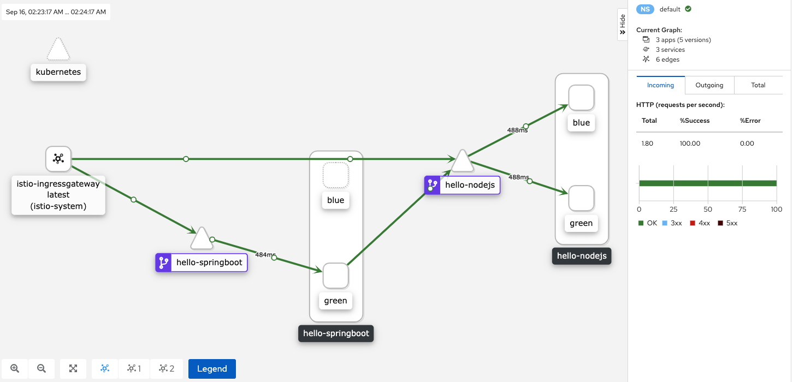

# Prerequisites

```bash
> minikube version --short
minikube version: v1.13.0

> helm version --short
v3.3.1+g249e521

> kubectl version --short
Client Version: v1.19.1
Server Version: v1.19.1

> istioctl version --short
1.7.1
```

## Quick Setup
```
bash ./setup.sh
```
Run the above command to setup the entire cluster and follow all the prompts.

## Load test the cluster
```
bash ./load-test.sh
```
Make sure your cluster is completely booted up and all applications are ready before starting the load tests

#### How to make a curl request to the applications (istio ingress gateway)
```bash
> minikube ip
192.168.64.6

> kubectl get svc -n istio-system
grafana                ClusterIP      10.97.209.196    <none>        3000/TCP                                                     3h31m
istio-ingressgateway   LoadBalancer   10.97.0.30       <pending>     15021:30279/TCP,80:30646/TCP,443:32326/TCP,15443:30762/TCP   3h31m
istiod                 ClusterIP      10.100.197.243   <none>        15010/TCP,15012/TCP,443/TCP,15014/TCP,853/TCP                3h32m
kiali                  ClusterIP      10.106.245.27    <none>        20001/TCP,9090/TCP                                           3h31m
prometheus             ClusterIP      10.103.5.68      <none>        9090/TCP                                                     3h31m
tracing                ClusterIP      10.101.140.128   <none>        80/TCP                                                       3h31m
zipkin                 ClusterIP      10.109.240.182   <none>        9411/TCP                                                     3h31m

copy port mapped to port 80, in this case 30646

> curl 192.168.64.6:30646/nodejs/hello
> curl 192.168.64.6:30646/springboot/hello
```

#### View the traffic network
```
> istioctl dashboard kiali
```
